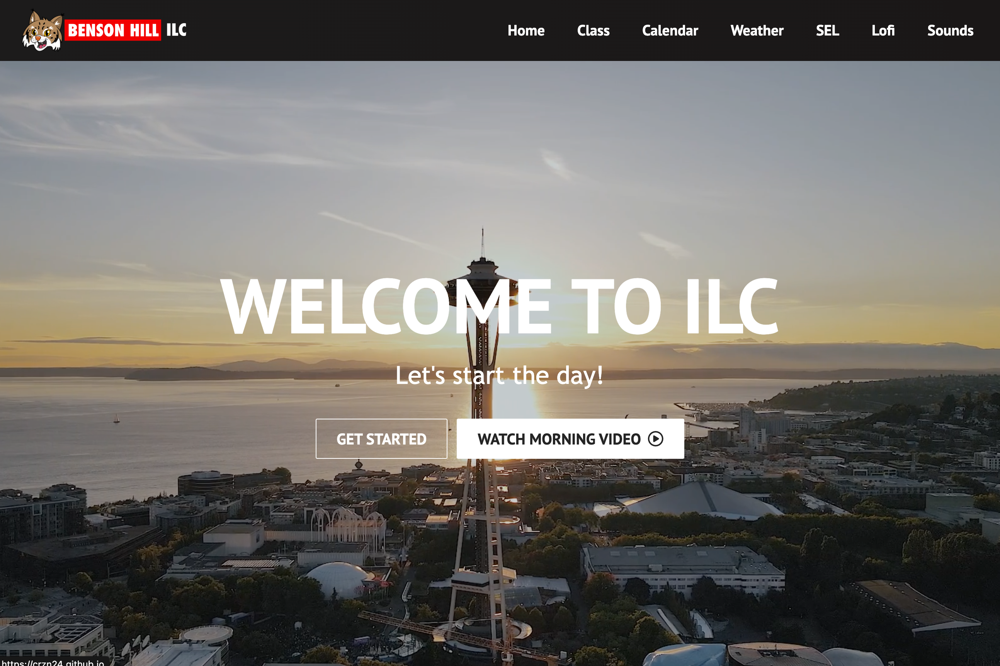
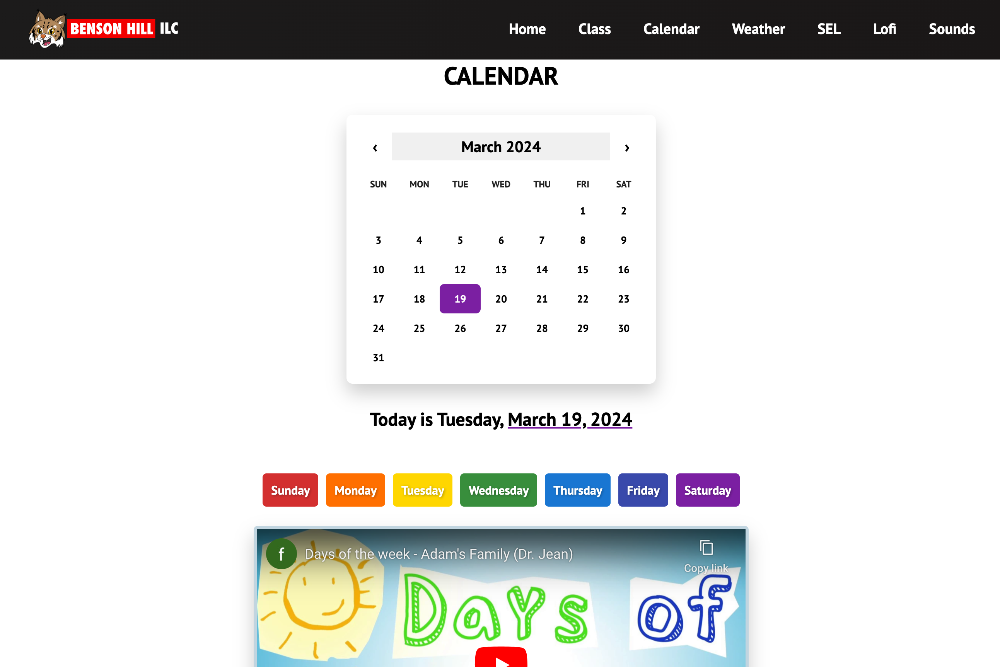
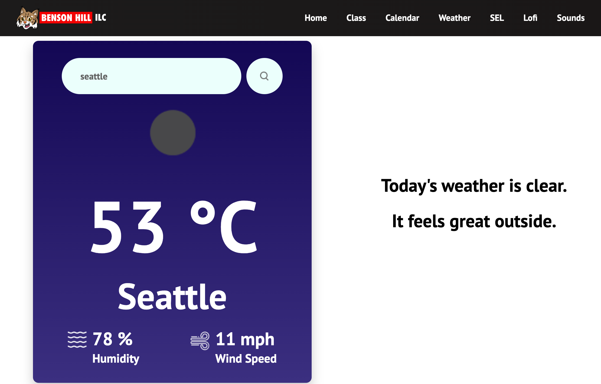
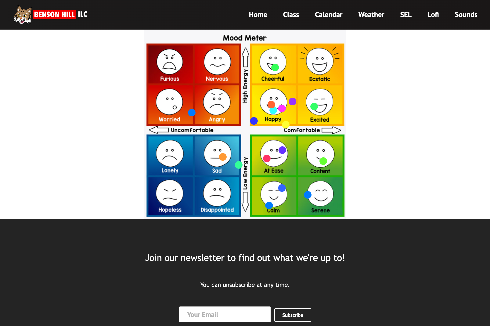

# Morning Meeting App
A classroom morning meeting app built using React!

## Description
This app was a project built using React. As an educator working in a elementary special education ILC classroom, I wanted an app that contained all of the materials and tools needed to run the start of our class' morning meeting so that everything could run seamlessly and be located in one place. The app is responsive and has some neat interactive elements.

While trying to get a static site deployed to GitHub, I ran into difficulties deploying a static vite react site. I found the best help to be a tutorial video. I was able to get a live site up but still ran into a bug that brought a user to a separate page that didn't have a route on my app. The user would have to manually go to the home page.


<!-- Provide a short description explaining the what, why, and how of your project. Use the following questions as a guide:

- What was your motivation?
- Why did you build this project? (Note: the answer is not "Because it was a homework assignment.")
- What problem does it solve?
- What did you learn? -->

<!-- ## User Story

```
AS A future junior developer and bootcamp graduate
I WANT a portfolio that showcases my past projects 
SO THAT employers can have a better assessment of my technical skills and consider me as a candidate for any open positions
``` -->

## Table of Contents

<!-- If your README is long, add a table of contents to make it easy for users to find what they need. -->

- [Morning Meeting App](#morning-meeting-app)
  - [Description](#description)
  - [Table of Contents](#table-of-contents)
  - [Installation](#installation)
  - [Credits](#credits)
  - [License](#license)
  - [Badges](#badges)
  - [Features](#features)
  - [Contribution](#contribution)
  - [Tests](#tests)
  - [Questions](#questions)

## Installation

No installation is required. 
Check out the [deployed app!](https://crzn24.github.io/morning-meeting-app/)

<!-- What are the steps required to install your project? Provide a step-by-step description of how to get the development environment running. -->











<!-- Provide instructions and examples for use. Include screenshots as needed.

To add a screenshot, create an `assets/images` folder in your repository and upload your screenshot to it. Then, using the relative filepath, add it to your README using the following syntax:

    ```md
    
    ``` -->

## Credits

Some of the resources used: 
* [React Calendar](https://www.npmjs.com/package/react-calendar)
* [React Calendar](https://github.com/wojtekmaj/react-calendar#readme)
* [React Player](https://www.npmjs.com/package/react-player)
* [Trigger stop method for react-player](https://stackoverflow.com/questions/70096664/)
* [React Router use navigate](https://reactrouter.com/en/main/hooks/use-navigate)
* [React Router scroll to top](https://www.matthewhoelter.com/2022/04/02/how-to-scroll-to-top-on-route-change-with-react-router-dom-v6.html)
* [Vite static deploy](https://vitejs.dev/guide/static-deploy.html)
* [Vite static deploy tutorial](https://github.com/sitek94/vite-deploy-demo?tab=readme-ov-file)
* [Opening links in new tab](https://www.w3schools.com/tags/att_a_target.asp)


## License


<!-- The last section of a high-quality README file is the license. This lets other developers know what they can and cannot do with your project. If you need help choosing a license, refer to [https://choosealicense.com/](https://choosealicense.com/). -->

---

<!-- 🏆 The previous sections are the bare minimum, and your project will ultimately determine the content of this document. You might also want to consider adding the following sections. -->

## Badges


<!--  -->

<!--  -->

<!-- Badges aren't necessary, per se, but they demonstrate street cred. Badges let other developers know that you know what you're doing. Check out the badges hosted by [shields.io](https://shields.io/). You may not understand what they all represent now, but you will in time. -->

## Features

This page features:

- React components
- Mobile friendly and responsive
- Deployed using gh-pages
- Navbar that links to corresponding pages
- Initial video that goes to the next page after finishing
- Class roster page with popup modal to greet each individual
- Interactive calendar page that displays today's date, has a hovering days of the week section to use during the days of the week video.
- Weather page that displays weather conditions of any city using Openweather API. 
- Social Emotional Learning page that displays an emotions chart that allows marking of feelings. Dots are draggable and colors are random.
- Lofi page allows playing of a lofi YouTube playlist. React player has a colored pulsing glow that can be changed by clicking one of three color buttons.
- Soundboard page that contains multiple buttons that when clicked, trigger a sound to play.
- 

<!-- If your project has a lot of features, list them here. -->

<!-- ## How to Contribute

If you created an application or package and would like other developers to contribute it, you can include guidelines for how to do so. The [Contributor Covenant](https://www.contributor-covenant.org/) is an industry standard, but you can always write your own if you'd prefer. -->

## Contribution 
N/A but please contact with any questions or suggestions

## Tests

- 
- 
- 
- 
- 
- 
<!-- - Click 'View Portfolio' button on home page to automatically scroll to first component.
- Click any item in the navbar to be redirected to the corresponding page component.
- Resize window or open on mobile device to see responsive content elements and collapsing navbar menu.
- Click responsive side elements to be taken to LinkedIn profile, GitHub profile, send an email, or download resume.
- Click on any portfolio items' links to open deployed app or repo in a new tab. -->
<!-- Go the extra mile and write tests for your application. Then provide examples on how to run them here. -->

## Questions
Github: crzn24

